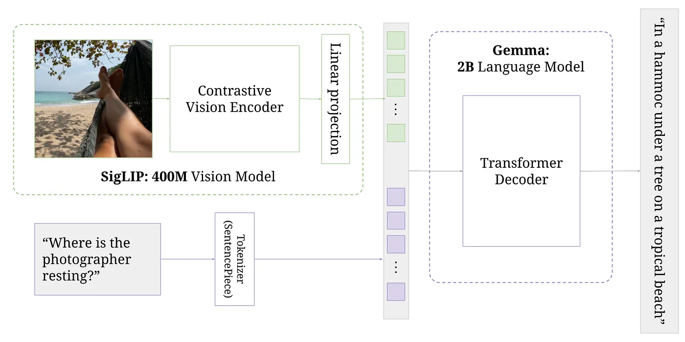

# Vision Transformers from Scratch

This repository implements a vision model from scratch using PyTorch. The model leverages transformers to perform image processing and inference tasks. Below, you will find instructions on how to run the model, descriptions of the files in this repository, and details about sample inputs and outputs.



---

## Table of Contents
1. [Overview](#overview)
2. [Setup Instructions](#setup-instructions)
3. [Running the Model](#running-the-model)
4. [Files Description](#files-description)
5. [Sample Inputs and Outputs](#sample-inputs-and-outputs)

---

## Overview
This project demonstrates the use of vision transformers (ViT) for processing image data. The implementation is built entirely from scratch in PyTorch to provide an in-depth understanding of transformer-based vision models. The script `launch_inference.sh` runs the model to produce outputs for the given inputs.

## Setup Instructions

1. Clone the repository:
   ```bash
   git clone <repository-url>
   cd Visual_Transformers_Pytorch
   ```
2. Install the required Python dependencies:
   ```bash
   pip install -r requirements.txt
   ```
3. Make necessary changes in the launch_inference file to satisfy file paths and prompt
 

## Running the Model

To execute the model and obtain output images:

1. Use the provided script:
   ```bash
   ./launch_inference.sh
   ```
2. This script will load the model, process the input images, and save the output images to the repository directory.

3. The pre-trained model weights can be downloaded from this [Google Drive link](https://drive.google.com/drive/folders/1gI2jVOYvc5o5xIHj-HCh-FnU4SuaB1o_?usp=sharing).

---

## Files Description

### 1. `paligemma-3b-pt-224`
A directory or file containing the pre-trained weights or configurations for the Vision Transformer (ViT).

### 2. `bottle.png`
A sample input image demonstrating the model’s capability to process an object like a bottle.

### 3. `white.jpg`
Another sample input image showcasing the model’s ability to process a different visual scenario.

### 4. `output_Bottle.png`
The output generated by the model when processing `bottle.png`. It showcases the model’s inference result.

### 5. `output_White_House.png`
The output generated by the model when processing `white.jpg`. It highlights the model’s interpretation of the image.

### 6. `inference.py`
The main Python script for running the vision transformer model. This script includes functions to load the model, process images, and save output.

### 7. `launch_inference.sh`
A shell script to streamline the process of running the model. It sets up the environment and executes `inference.py` with the appropriate arguments.

### 8. `modeling_gemma.py`
Contains the PyTorch implementation of the Vision Transformer. This file includes the model architecture and forward propagation logic.

### 9. `modeling_siglip.py`
Another variation of the transformer model, likely used for experimentation or comparison purposes.

### 10. `processing_paligemma.py`
A script to preprocess images or other data before passing them into the transformer model. It includes functions for data normalization and augmentation.

### 11. `README.md`
This file, providing an overview of the repository and detailed instructions for usage.

### 12. `requirements.txt`
Lists all the Python dependencies required to run the model. Install these with `pip install -r requirements.txt`.

### 13. `utils.py`
Contains utility functions for the project, such as helper functions for image loading, processing, and evaluation metrics.

### 14. `vit.ipynb`
A Jupyter Notebook illustrating the working of the Vision Transformer model. This is useful for debugging, experimentation, or understanding the inner workings interactively.

### 15. `__pycache__`
A folder automatically generated by Python to store bytecode-compiled versions of Python files for faster execution.

---

## Sample Inputs and Outputs

- **Inputs:**
  - `bottle.png`
  - `white.jpg`

- **Outputs:**
  - `output_Bottle.png`: The model’s processed output for `bottle.png`.
  - `output_White_House.png`: The processed result for `white.jpg`.

These input-output examples showcase the model’s ability to interpret and transform image data effectively.

---

## Additional Notes
- The model is implemented in PyTorch, and understanding its architecture can help build a strong foundation in transformer-based vision models.
- For any issues or bugs, feel free to raise an issue in this repository.

---

**Author:** Sai Akhil Kogilathota

